# findr_app--flutter app

Findr 🔎

A Smart Lost, Found & Resell Platform for Campus Communities

Project Description

Findr is a campus-focused lost, found, and resell platform designed to improve communication about misplaced or reusable items within a college environment.

Currently, lost-and-found communication happens mostly through WhatsApp groups, where posts often get ignored, buried, or missed. Findr replaces this unreliable system with a structured, searchable, and interactive platform built specifically for students.

The app allows users to post lost items, report found items, sell second-hand goods, chat with item owners in real time, and receive automatic match suggestions based on descriptions.

Tech Stack & Dependencies

Frontend

Flutter

Dart

Backend

Supabase (Authentication, Database, Storage, Realtime Chat)

Libraries

Supabase Flutter SDK

Image picker

Tools

Visual Studio Code

GitHub

Features

Email-based authentication with profile details

Post Lost, Found, and Resell items

Smart description-based matching suggestions

Real-time chat linked to posts

Save potential matches for later

Profile dashboard with editable details

View and manage own posts

Swipe-to-logout feature

Build Commands
flutter pub get
flutter run
APK Build Instructions

To generate an APK file:

flutter build apk --release

APK will be available at:

build/app/outputs/flutter-apk/app-release.apk
Installation Guide (Android)

Download the APK file

Enable Install from Unknown Sources in device settings

Open the APK and install

Launch the Findr app

Screenshots

(Add at least 3 screenshots here)

## 📱 App Screenshots

### 🚀 Get Started
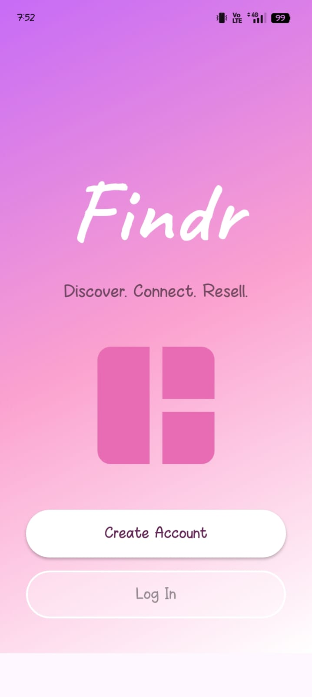

### 🔐 Login
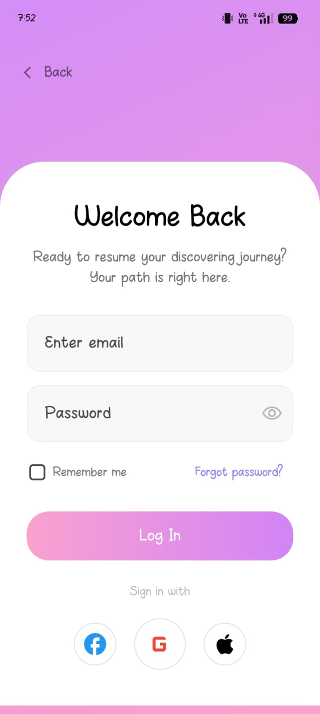

### 📝 Signup
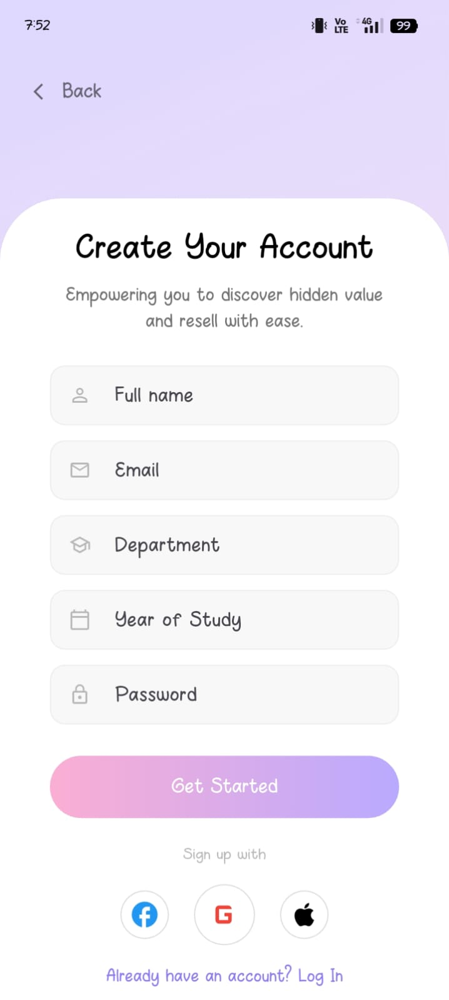

### 🏠 Home
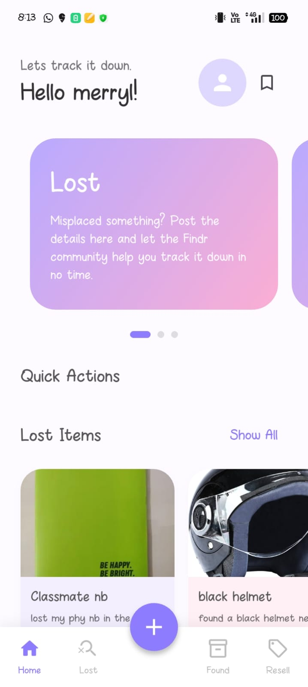

### 💬 Realtime Chat
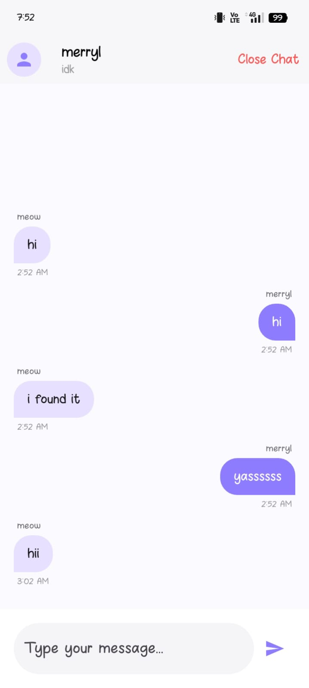

### 👤 Profile
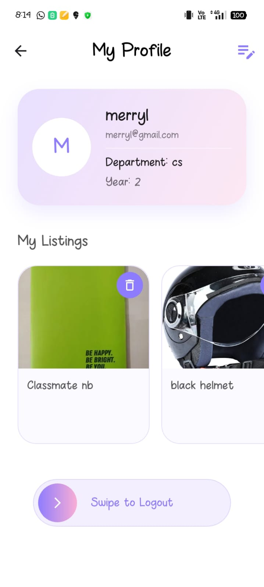

### ✏️ Edit Profile
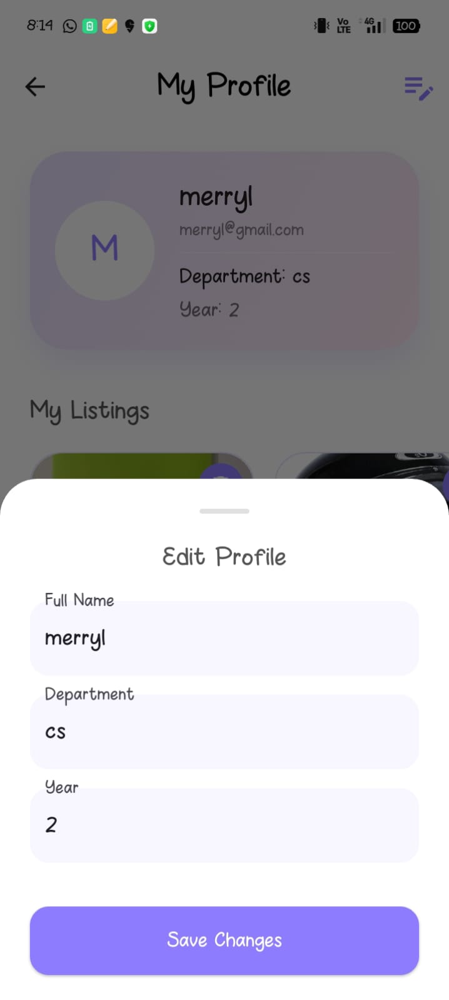

### ➕ Add Post
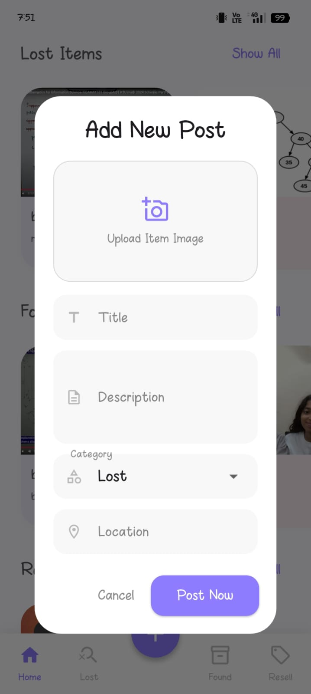

### 🧾 Item Dialog
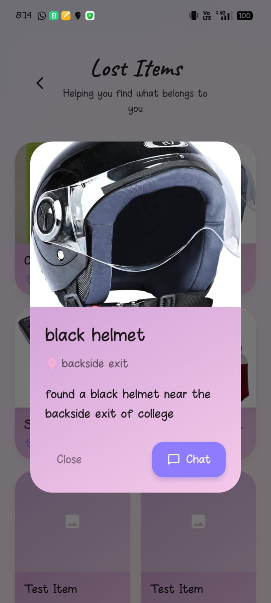

### 🤝 Match Screen
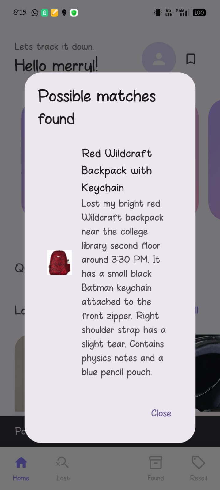 
Demo Video (Required)

[(Add Google Drive or YouTube link here)](https://drive.google.com/file/d/1-UvM8jDfdyasax3WhJPDTiFL_WFt8jn6/view?usp=drive_link)

The demo should show:

Login/signup

Posting item

Match suggestion popup

Real-time chat

App Flow DiagramD

Architecture Diagram

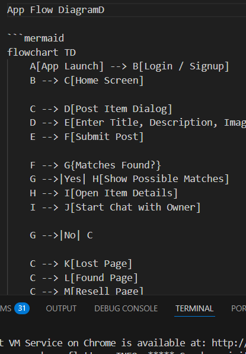

Folder Structure
lib/
assets/
docs/
android/
ios/
Code Quality

Organized into screens, services, and widgets

Comments added for key logic

Git commits structured by feature

Team Members

Team Name: avyl

Avanthika Sreejith — Backend

Merryl Johns — Frontend

License

This project is licensed under the MIT License.